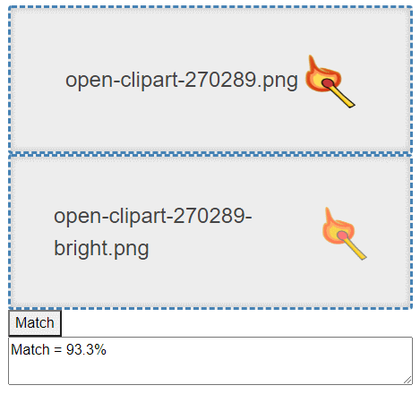
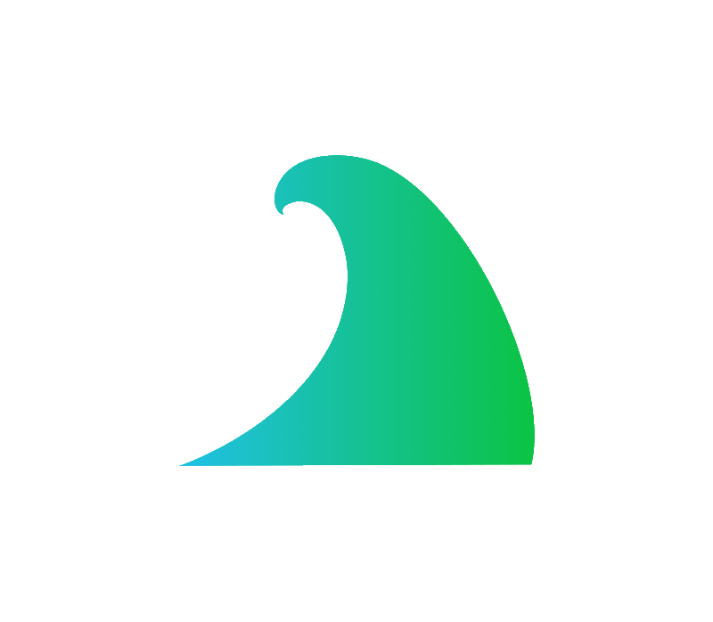
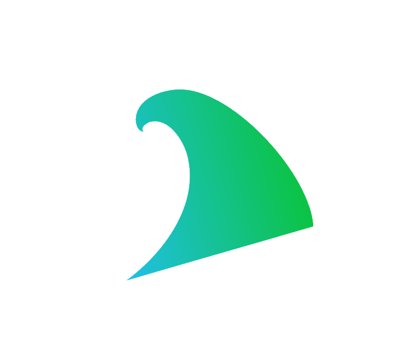

# Image Wave

A less simple method to match images

# Features

* runs on .NET Core
* runs in browser with webassembly
* commandline client
* less worse than other [algorithms](https://github.com/TrevorDArcyEvans/ImageMatch)

# Discussion
This algorithm uses a discrete wavelet transform (DWT) to calculate the root mean square (RMS)
distance between the details of two images.
1. resize each image to 256x256
2. convert each image to black and white
3. take DWT of each image
4. calculate RMS distance of details between images

## Comparison

There are several reference images from a previous
project [(ImageWave)](https://github.com/TrevorDArcyEvans/ImageMatch):

  
Baseline

  
Baseline + brightness & contrast changed

  
Baseline + resized 80%

  
Baseline + rotated slightly

  
Baseline + rotated more

| Image                 | ImageMatch | ImageWave |
|-----------------------|------------|-----------|
| brightness & contrast | 78%        | 93%       |
| resized               | 95%        | 92%       |
| rotated slightly      | 90%        | 89%       |
| rotated more          | 54%        | 88%       |

As should be obvious, _ImageWave_ performs significantly better than the naiive algorithm in _ImageMatch_, especially
when the other image has been rotated.

## Further comparison

  
Baseline

  
Baseline + rotated

  
Baseline + rotated 90

| Image      | ImageMatch | ImageWave |
|------------|------------|-----------|
| rotated    | 46%        | 93%       |
| rotated-90 | 28%        | 93%       |

# Further work
* experiment with different mother wavelets
  * current uses [Haar wavelet](https://en.wikipedia.org/wiki/Haar_wavelet)
* experiment with DWT depth level
  * currently set to 1
* RMS of details is currently not weighted
* fix _WaveletStudio_ unit tests

# Further information

* [Algorithm to compare two images](https://stackoverflow.com/questions/23931/algorithm-to-compare-two-images)
* [Discrete Wavelet Transform](https://en.wikipedia.org/wiki/Discrete_wavelet_transform)

# Acknowledgements

* [WaveletStudio](https://github.com/DragonLi/waveletstudio)
* [WaveletStudio](https://github.com/walteram/waveletstudio)
* [Ocean Wave 3](https://openclipart.org/detail/120655/ocean-wave-3)

